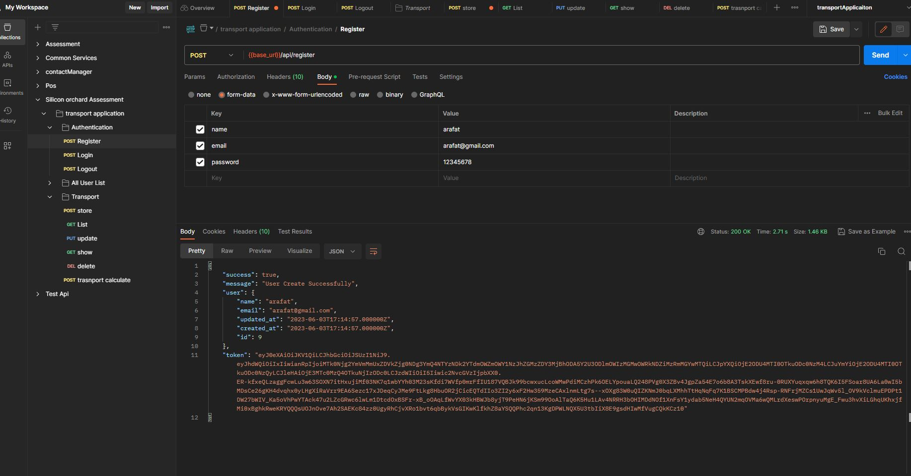
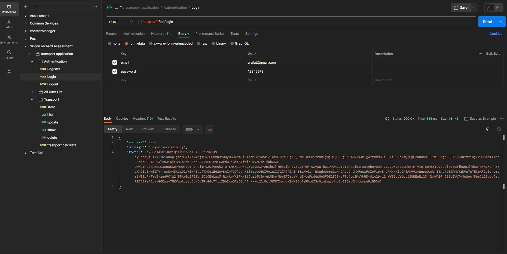
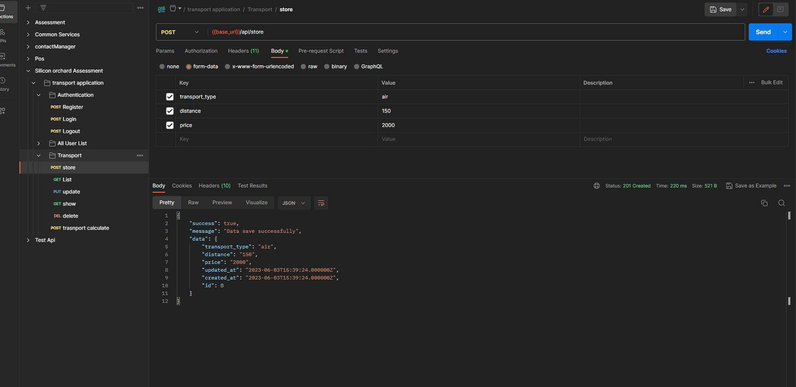
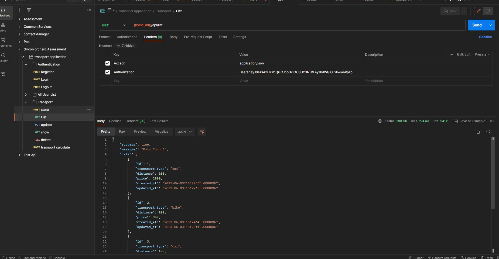
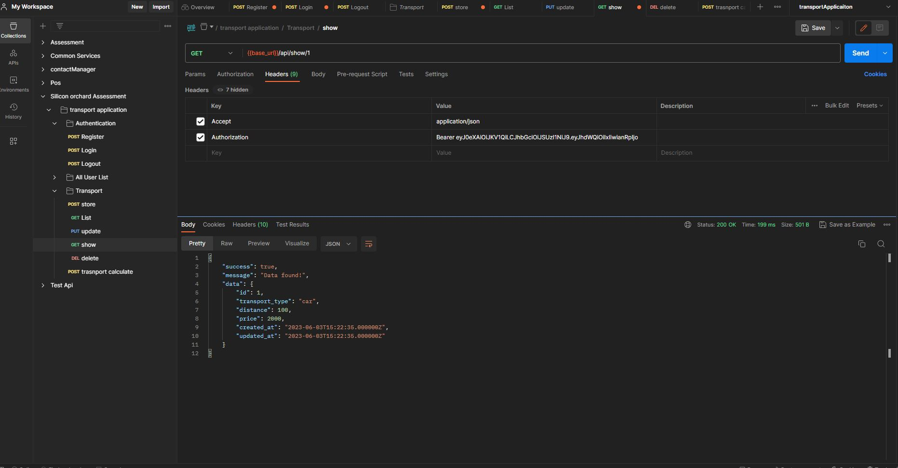
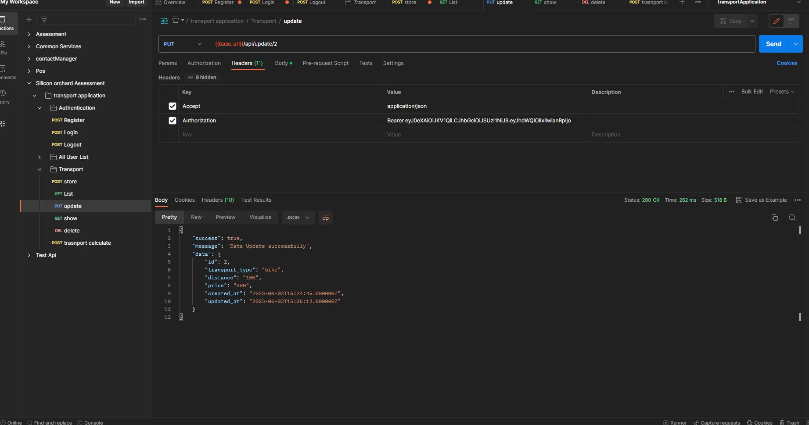
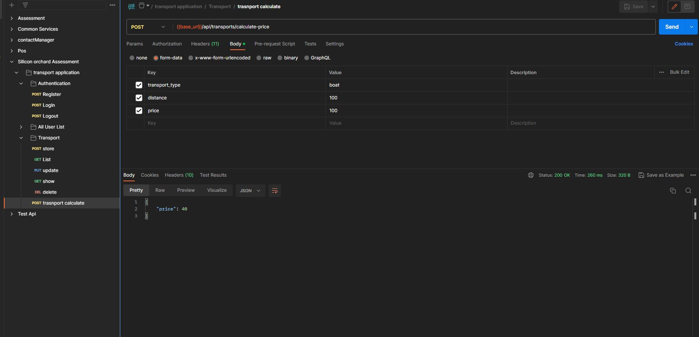

## Silicon orchard ltd - Assignment

## Author - Md Arifuzzaman

## email - arifuzzamanarif42@gmail.com

## Installation

## Git clone: git clone https://github.com/Arif46/-transport--application-backend-laravel.git
## xampp install for php 8.1
## Run: composer install
## Rename .env.example file to .env
## Open .env file and provide your database information
## Run php artisan key:generate
## Run php artisan migrate
## Run php artisan serve

## registration

## login

## transport store

## transport list

## transport show

## transport update

## transport update

 